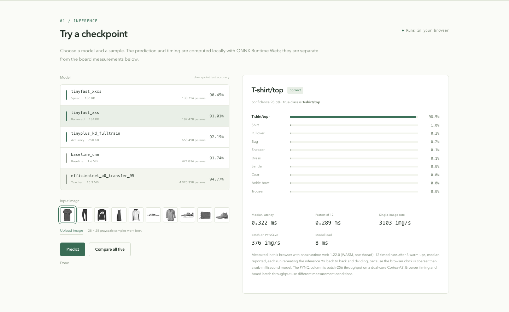

# Fashion Frontier

Training, distillation and deployment experiments for **Fashion-MNIST on PYNQ-Z1**. This repository contains model definitions, training configurations, ONNX export and quantization tools, and the experiment records.

[中文](README_CN.md) · [Browser demo](https://xzgzszrh.github.io/fashion-frontier/) · [Reproduction guide](docs/10-reproducing.md) · [PYNQ Runner](https://github.com/xzgzszrh/pynq-runner)



## What is included

- A baseline CNN and an EfficientNet-B0 teacher.
- Compact CNN students trained with knowledge distillation, with FP32 and INT8 export paths.
- PYNQ CPU benchmark tools and records from the BNN-PYNQ and FINN experiments.
- Five ONNX checkpoints that can run directly in a browser.

The board interface is maintained separately in **[PYNQ Runner](https://github.com/xzgzszrh/pynq-runner)**. It loads local ONNX models, accepts tensor or image inputs, and measures inference time without depending on this dataset.

## Results

CPU results below are transcribed from the paper's Table 8. Throughput was measured on PYNQ-Z1 with ONNX Runtime, batch size 256, two intra-op threads and one inter-op thread.

| INT8 student | Test accuracy | Board throughput | Time for 10,000 images |
|---|---:|---:|---:|
| `tinyplus_kd_fulltrain` | 92.21% | 186.8 img/s | 53.5 s |
| `tinyfast_xs` | — | ~310 img/s | — |
| `tinyfast_xxs` | 91.09% | 375.99 img/s | 26.60 s |
| `tinyfast_xxxs` | 90.45% | 445.19 img/s | 22.46 s |

The teacher reaches 94.77% test accuracy. The smaller students reduce CPU inference cost at some loss of accuracy.

The FPGA experiments use different measurement conditions:

- **BNN-PYNQ LFC 1W1A:** 83.16% test accuracy; 154,096 img/s accelerator throughput at batch 256, excluding Python packing overhead. See [BNN experiments](docs/06-bnn-route.md).
- **FINN 4W4A:** 93.55% on the host. A bitstream was built and executed, but board output did not match the reference. See [FINN deployment](docs/05-fpga-finn-deployment.md).

[All experiment records](benchmarks/results.csv) include source references. They are historical records, not results from a new run of this repository. The bundled `tinyfast_xxs` and `tinyplus` checkpoints were recorded at 91.01% and 92.19% during verification; the paper values above are retained separately. Browser timings come from the visitor's device.

## Run the demo

```bash
git clone https://github.com/xzgzszrh/fashion-frontier.git
cd fashion-frontier
python3 -m http.server 8000
```

Open **http://localhost:8000/web/**. Select a model and an image, then choose **Predict** or **Compare all five**. ONNX Runtime Web is downloaded from a CDN; model files and sample images are included. Images stay in the browser.

## Train and export

Use Python 3.10 or later on the training machine:

```bash
python3 -m venv .venv
source .venv/bin/activate
pip install -e ".[dev]"

frontier models
frontier train --config configs/teacher/01_baseline_cnn.yaml
```

For the teacher → soft targets → students → ONNX → INT8 route:

```bash
make cpu-route
```

See the [reproduction guide](docs/10-reproducing.md) for individual commands, dataset preparation and board benchmarking. Training code was reconstructed from the experiments; a fresh run is not guaranteed to reproduce the historical accuracies. Optional quantized training uses `pip install -e ".[quant]"`; FPGA synthesis requires its own toolchain.

## Repository map

| Directory | Contents |
|---|---|
| `src/fashionfrontier/` | Models, training, distillation, export and benchmark code |
| `configs/` | Teacher, student, quantization and board configurations |
| `benchmarks/` | Historical results and provenance |
| `web/` | Browser demo, five ONNX checkpoints and sample images |
| `docs/` | Experiment notes and reproduction instructions |

Useful notes: [teacher training](docs/02-training-from-baseline-to-teacher.md), [distillation](docs/03-distillation.md), [CPU deployment](docs/07-cpu-only-route.md), [unsuccessful experiments](docs/09-lessons-and-negative-results.md).

## Development

```bash
make test
make lint
make web-data     # regenerate the website's experiment data
```

Tests cover model shapes, data splits, distillation losses, ONNX export and benchmark behavior. Use `?selftest=1` on the demo URL to run all five checkpoints over the ten bundled samples; this is a smoke test, not a dataset accuracy evaluation.

MIT license. See [LICENSE](LICENSE) and [CITATION.cff](CITATION.cff).
