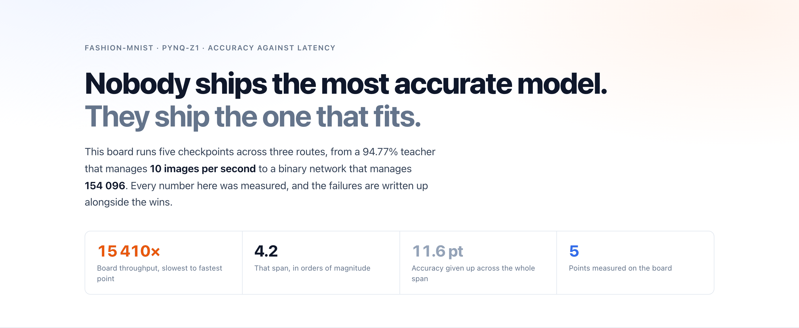
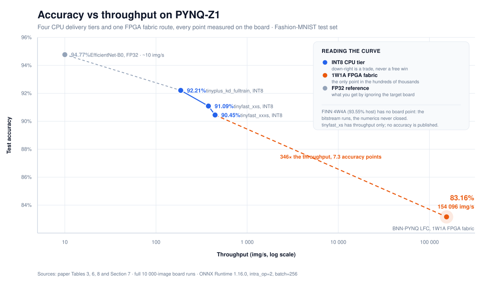
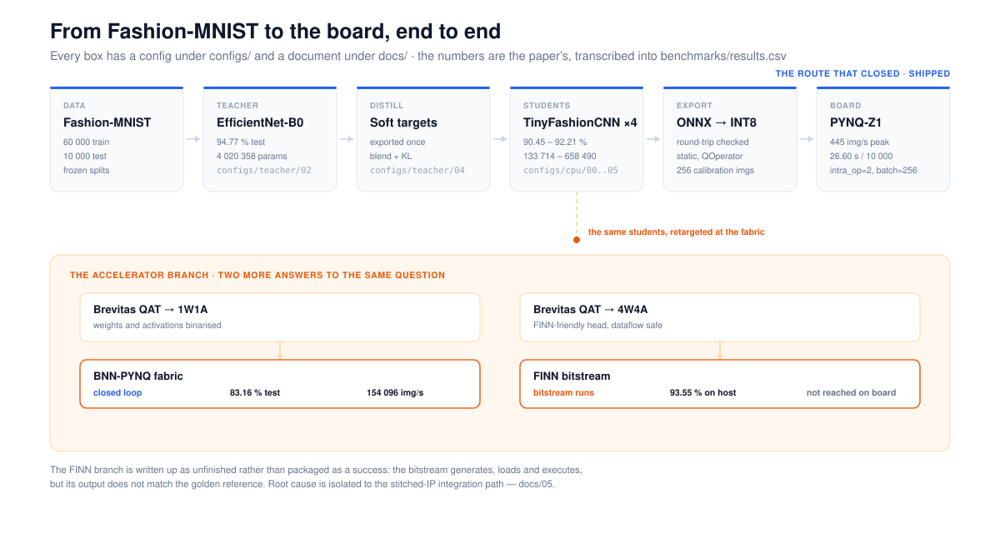
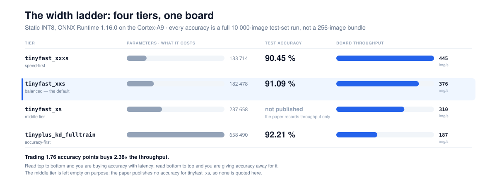
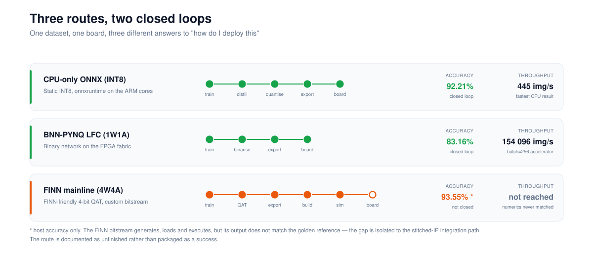
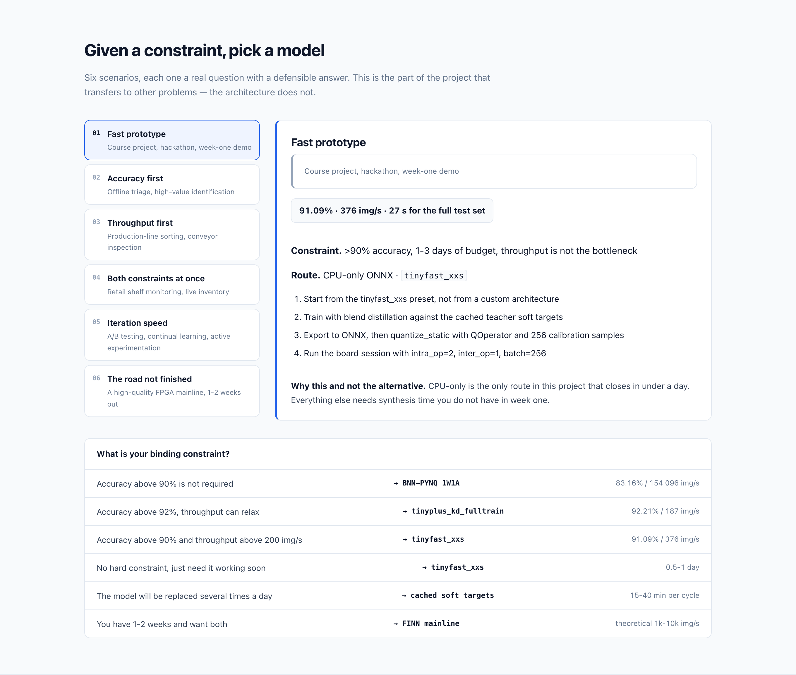
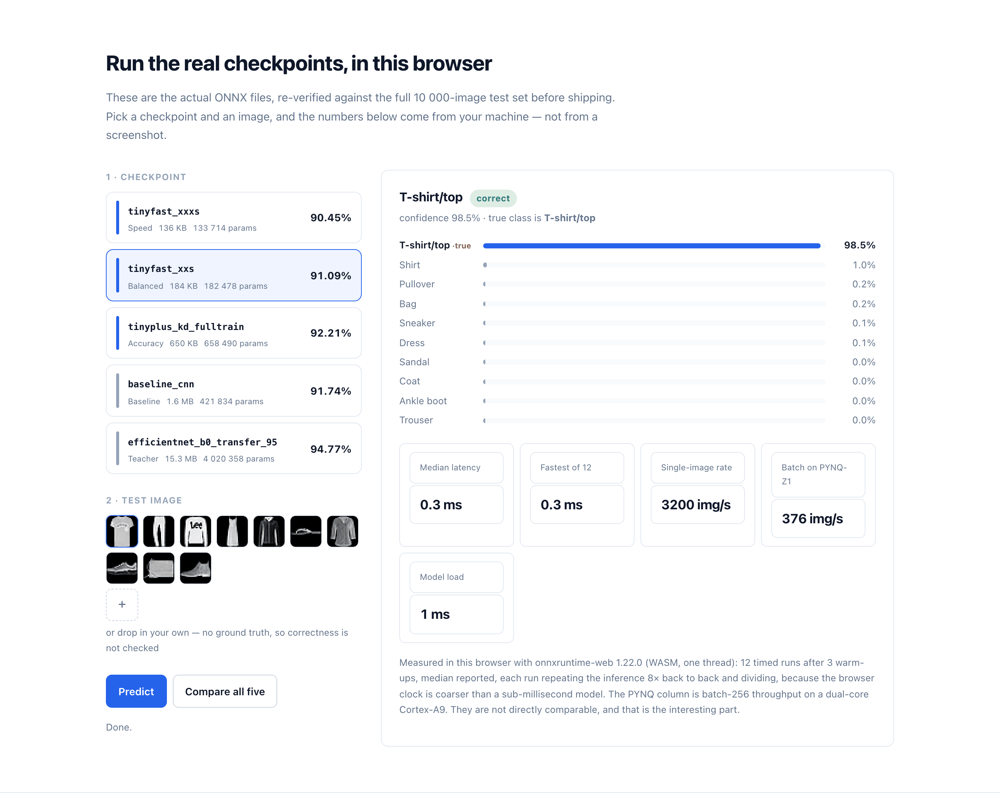
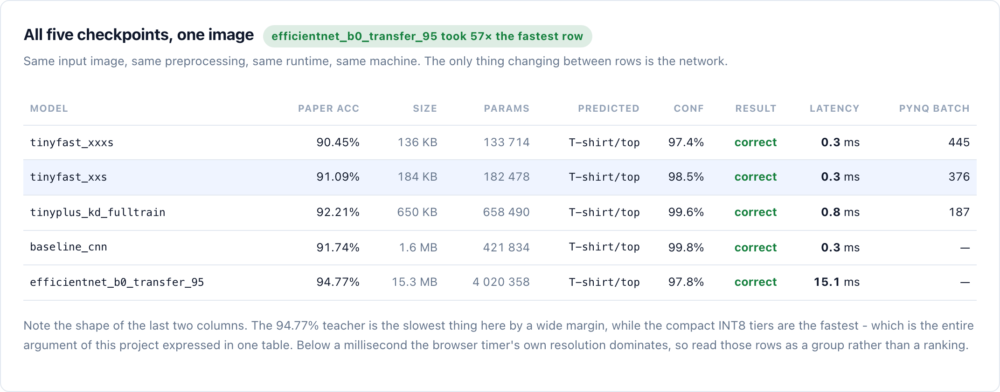
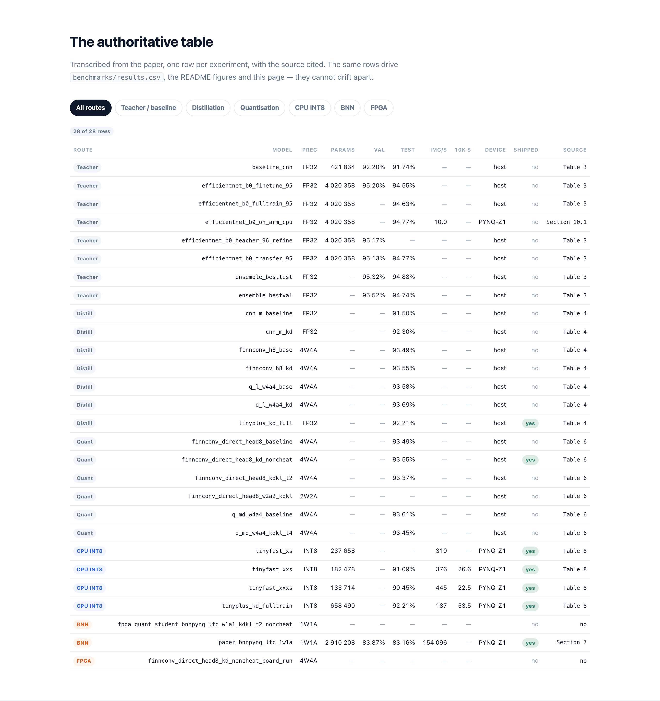

<div align="center">



<h1>Fashion Frontier</h1>

<p><b>从模型训练到板端推理：Fashion-MNIST 在 PYNQ-Z1 上的准确率、速度与部署取舍。</b></p>

<p>
  
  
  
  
  
</p>

<p>
  <a href="https://xzgzszrh.github.io/fashion-frontier/"><b>在线演示</b></a> ·
  <a href="#在线演示与本地运行">本地运行</a> ·
  <a href="#模型档位">模型档位</a> ·
  <a href="#场景选型">场景选型</a> ·
  <a href="#失败案例">失败复盘</a> ·
  <a href="README.md"><b>English</b></a>
</p>

</div>

---

## 目录

| | |
|---|---|
| [项目概览](#项目概览) | 准确率与吞吐的变化 |
| [训练与部署流程](#训练与部署流程) | 教师、蒸馏、量化与板端推理 |
| [模型档位](#模型档位) | 四个 INT8 学生模型的对比 |
| [三条部署路线](#三条部署路线) | CPU、BNN-PYNQ 与 FINN |
| [场景选型](#场景选型) | 按准确率、吞吐和迭代需求选择 |
| [在线演示与本地运行](#在线演示与本地运行) | 五个 ONNX 模型的浏览器推理 |
| [快速开始](#快速开始) | 安装、训练、导出与测速 |
| [数据说明](#数据说明) · [失败案例](#失败案例) · [文档索引](#文档索引) | 实验来源、问题记录与详细文档 |

---

## 项目概览

Fashion Frontier 围绕一个具体问题展开：**在 PYNQ-Z1 上，怎样选择既能满足准确率要求、又能承受板端推理开销的模型？**

项目从 Fashion-MNIST 分类任务出发，训练 EfficientNet-B0 教师模型，再通过知识蒸馏和量化得到轻量学生模型。CPU 与 FPGA 两侧的部署实验用于比较不同方案的准确率、吞吐和工程成本。



教师模型的测试准确率为 94.77%；CPU 学生模型覆盖 90.45%–92.21%，吞吐最高达到 445.19 img/s。BNN-PYNQ 的二值网络获得更高的加速器吞吐，同时准确率降至 83.16%。CPU 与 FPGA 的计时范围不同，具体条件见[数据说明](#数据说明)。

## 训练与部署流程

CPU 路线依次经过教师训练、软标签导出、学生训练、ONNX 导出和 INT8 量化。FPGA 路线另外考察了二值网络，以及适配 FINN 数据流工具链的量化网络。



教师输出可以缓存为软标签，供多轮学生实验复用。调整学生结构时，只需重新训练和导出学生模型。各阶段的配置保存在 `configs/`，分步操作见[复现指南](docs/10-reproducing.md)。

## 模型档位

四个 CPU 学生采用不同网络宽度。下图展示它们的参数量和论文中记录的板端表现。



| 档位 | 模型 | 测试准确率 | 吞吐 | 10,000 张耗时 | 参数量 |
|---|---|---:|---:|---:|---:|
| 精度优先 | `tinyplus_kd_fulltrain` | **92.21%** | 186.8 img/s | 53.5 s | 658,490 |
| 中间档 | `tinyfast_xs` | — | ~310 img/s | — | 237,658 |
| 均衡档 | `tinyfast_xxs` | 91.09% | 375.99 img/s | 26.60 s | 182,478 |
| 速度优先 | `tinyfast_xxxs` | 90.45% | **445.19 img/s** | **22.46 s** | 133,714 |

CPU 计时使用 ONNX Runtime 1.16.0，`intra_op=2`、`inter_op=1`、batch 256，完整测试集包含 10,000 张图片。准确率与吞吐转录自论文表 8，参数量由模型结构计算。`tinyfast_xs` 没有公开准确率记录。

从 TinyPlus 到 XXXS，准确率相差 **1.76 个百分点**，吞吐相差约 **2.38 倍**。对准确率要求较高时可以从 TinyPlus 开始；受 CPU 吞吐限制时，可以进一步比较 XXS 和 XXXS。

## 三条部署路线



| 路线 | 准确率 | 吞吐 | 当前结果 |
|---|---:|---:|---|
| **CPU-only ONNX · INT8** | 90.45%–92.21% | 186.8–445.19 img/s | 多个学生模型已有板测记录 |
| **BNN-PYNQ · 1W1A** | 83.16% | 154,096 img/s | 已运行，吞吐为 batch 256 下的加速器计时 |
| **FINN · 4W4A** | 93.55%（主机端） | 未取得有效结果 | bitstream 可执行，输出与参考值不一致 |

图中的 CPU 准确率与吞吐分别取自不同模型的最佳值，不能组合成同一个模型的性能。FINN 的构建过程和数值验证记录见[部署文档](docs/05-fpga-finn-deployment.md)。

## 场景选型

选型可以从任务约束出发：需要多少准确率、能接受多大的批次，以及模型多久更新一次。下面保留原版演示中的场景面板与决策树。



| 需求 | 可优先评估的方案 | 需要确认的条件 |
|---|---|---|
| 尽快完成一个板端原型 | CPU ONNX · `tinyfast_xxs` | 板端运行时和输入预处理是否匹配 |
| 优先保留 CPU 路线的准确率 | `tinyplus_kd_fulltrain` | 是否能接受 186.8 img/s 的历史吞吐水平 |
| 需要较高的批处理吞吐 | BNN-PYNQ · 1W1A | 83.16% 准确率及 batch 256 是否适合任务 |
| 同时要求 >90% 准确率、>200 img/s | `tinyfast_xxs` 或 `tinyfast_xxxs` | 实际批次、端到端延迟和误分类分布 |
| 频繁调整或替换模型 | CPU ONNX + 缓存软标签 | 学生训练、重新导出和量化的成本 |
| 继续探索高准确率 FPGA 部署 | FINN · 4W4A | 先解决板端数值验证问题 |

截图中的时间估计来自早期规划，不能视为交付承诺；FINN 的预期吞吐也尚未实测。逐项配置与讨论见[场景手册](docs/08-scenario-playbook.md)。

## 部署经验

实验中影响部署进度的几个问题：

| 问题 | 对后续工作的影响 |
|---|---|
| 部分池化、展平和矩阵运算无法直接进入 FINN 数据流 | 重新设计了适配 FINN 的网络结构 |
| 较大模型的权重存储超出 BRAM 预算 | 在完整综合前增加资源估算 |
| 教师模型在 ARM CPU 上仅约 10 img/s | 改用轻量学生模型进行 CPU 部署 |
| bitstream 能运行，但输出与参考模型不同 | 按导出、单节点 RTL、stitched-IP 和板端逐层比较 |

这些记录保留在[问题复盘](docs/09-lessons-and-negative-results.md)中，可用于定位类似部署问题。

## 在线演示与本地运行

**[打开在线演示](https://xzgzszrh.github.io/fashion-frontier/)**，选择一个权重和一张图片，即可查看预测结果、类别分数和本机推理耗时。五个 [ONNX 权重](web/models/)已随仓库提供。



**Compare all five** 使用同一张图片依次运行五个模型，方便比较预测与耗时。教师模型和学生模型使用各自的输入尺寸及归一化配置。



以上保留原版界面截图；在线页面会随版本更新。浏览器推理通过 ONNX Runtime Web 的单线程 WASM 后端执行，计时来自访问者设备，不能当作 PYNQ 板测数据。

在仓库根目录启动本地演示：

```bash
python3 -m http.server 8000
```

打开 <http://localhost:8000/web/>。模型和样例从本地读取，ONNX Runtime Web 从 CDN 加载。在网址后加 `?selftest=1`，可让五个模型依次运行十张样例，检查推理链路。

## 快速开始

### 安装

训练电脑需要 Python 3.10+。以下命令适用于 macOS 和 Linux：

```bash
git clone https://github.com/xzgzszrh/fashion-frontier.git
cd fashion-frontier
python3 -m venv .venv
source .venv/bin/activate
python -m pip install -e ".[dev]"

frontier models
frontier results --only-deployed
```

### 训练、蒸馏与导出

完整 CPU 路线：

```bash
make cpu-route
```

也可以逐步运行教师训练、软标签导出及一个学生模型的训练与量化：

```bash
frontier train --config configs/teacher/02_efficientnet_b0_transfer.yaml

frontier export-soft-targets \
  --config configs/teacher/04_export_soft_targets.yaml \
  --checkpoint outputs/efficientnet_b0_transfer_95/best_model.pt \
  --out artifacts/teacher_targets_full_train.npz --split full_train

frontier train --config configs/cpu/04_tinyfast_xxs.yaml
frontier export-onnx --model tiny_fashion_cnn --variant tinyfast_xxs \
  --checkpoint outputs/tinyfast_xxs/best_model.pt --out artifacts/xxs_fp32.onnx
frontier quantize --model artifacts/xxs_fp32.onnx --out artifacts/xxs_int8.onnx
```

### 板端测速

在主机上导出测试集，然后复制到已有 NumPy 和 ONNX Runtime 的板端环境：

```bash
frontier export-test-set --out artifacts/fashion_mnist_test.npz
BOARD_PYTHON=/path/to/board/python ./scripts/deploy_to_board.sh <board-ip>
```

`BOARD_PYTHON` 指向板子上的解释器。脚本检查依赖后复制推理代码、ONNX 模型和测试集，再将测速结果取回 `benchmarks/board_raw/`。ARMv7 运行时准备见[部署说明](docs/10-reproducing.md)。

需要通过网页操作板端模型，可使用独立项目 **[PYNQ Runner](https://github.com/xzgzszrh/pynq-runner)**。

### 开发检查

```bash
make test
make lint
make web-data
```

测试覆盖模型结构、蒸馏损失、ONNX 导出和测速行为。更多命令见 `make help`。

## 仓库结构

```text
configs/
  teacher/   基线、教师训练与软标签导出
  cpu/       轻量学生与蒸馏配置
  quant/     Brevitas QAT、BNN 配置
  board/     板端运行时设置
src/fashionfrontier/
  data/      数据读取与训练、验证集切分
  models/    基线、教师、学生及量化模型
  distill/   软标签、blend 与 KL 蒸馏
  engine/    训练循环、EMA 与评估
  export/    ONNX 导出与 INT8 量化
  bench/     运行时会话与主机测速
  board/     板端测试与报告
benchmarks/  历史实验结果与来源
web/         浏览器推理演示、ONNX 权重与样例
assets/      图表与界面截图
docs/        分阶段实验记录与复现指南
```

## 数据说明

[`benchmarks/results.csv`](benchmarks/results.csv) 转录论文中的结果，每行保留来源章节。原版演示中的结果表如下：



阅读和引用时需区分三类数据：

- **论文记录**：README 中的历史结果，保留在 `benchmarks/results.csv`。
- **权重复测**：随仓库提供的 TinyPlus、XXS 权重复测记录为 92.19%、91.01%，与论文的 92.21%、91.09% 分开保留；其元数据位于 `scripts/build_web_data.py`。
- **当前运行**：浏览器计时来自当前电脑；新板测报告写入 `benchmarks/board_raw/`。

BNN 的 154,096 img/s 是 batch 256 下排除 Python 打包开销的加速器吞吐。完整测试集准确率为 83.16%；早期 256 张板测样本中的 214 张正确对应 83.59%，两者样本范围不同。

## 失败案例

项目也保留了未达到预期的实验：

- **二值学生训练降至约 10% 准确率。** 同时修改了拓扑、蒸馏方法和损失形式，需要拆开变量重新验证。
- **FINN 板端输出与主机结果不一致。** 分层测试将后续排查重点收敛到 stitched-IP 集成路径。
- **多次教师微调未超过 94.77%。** 验证集提升并不总能转化为测试集提升，相关配置和结果均有记录。

详细过程见[失败实验与问题复盘](docs/09-lessons-and-negative-results.md)。

## 复现范围

CPU、量化和 BNN 的代码根据原实验整理重建，重新训练不保证逐位复现历史结果。FINN 4W4A 尚未完成板端数值验证；2W2A 实验也没有完整结果。FPGA 综合还需要单独配置 FINN 与 Vivado/Vitis 工具链。

## 文档索引

| | |
|---|---|
| [00](docs/00-overview.md) | 项目总览 |
| [01](docs/01-platform-and-path-selection.md) | 平台资源与 PS/PL 路线选择 |
| [02](docs/02-training-from-baseline-to-teacher.md) | 基线与教师模型训练 |
| [03](docs/03-distillation.md) | 知识蒸馏实验 |
| [04](docs/04-quantization-and-finn-friendly-design.md) | QAT 与面向 FINN 的结构设计 |
| [05](docs/05-fpga-finn-deployment.md) | FINN 构建与分层验证 |
| [06](docs/06-bnn-route.md) | BNN-PYNQ 二值路线 |
| [07](docs/07-cpu-only-route.md) | CPU 部署与调优 |
| [08](docs/08-scenario-playbook.md) | 场景选型 |
| [09](docs/09-lessons-and-negative-results.md) | 失败实验与问题复盘 |
| [10](docs/10-reproducing.md) | 复现步骤 |

## 硬件参考

| | |
|---|---|
| SoC | Xilinx Zynq-7020 |
| PS | 双核 ARM Cortex-A9 @ 650 MHz |
| PL | Artix-7 XC7Z020（53 200 LUT，106 400 FF，140 BRAM36K，220 DSP） |
| 内存 | 512 MB DDR3，256 KB 片上 SRAM |
| 系统 | PYNQ Linux 3.0，Python 3.10，ONNX Runtime 1.16.0 |

## 引用

如果你使用了本仓库，请引用这个软件；如果你引用了 `benchmarks/results.csv` 中的数字，请引用它所转录自的论文。机器可读的元数据在 [`CITATION.cff`](CITATION.cff)。

```bibtex
@software{fashion_frontier_2026,
  title  = {Fashion Frontier: End-to-End Inference Engineering on PYNQ-Z1},
  author = {xzgzszrh},
  year   = {2026},
  url    = {https://github.com/xzgzszrh/fashion-frontier},
  note   = {面向 Fashion-MNIST 的实测精度/吞吐前沿：四条 CPU 档位与两条加速器路线}
}
```

## 许可证

MIT，见 [LICENSE](LICENSE)。
